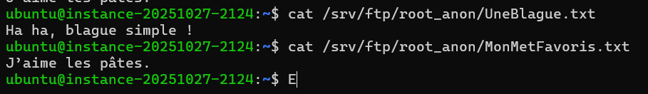
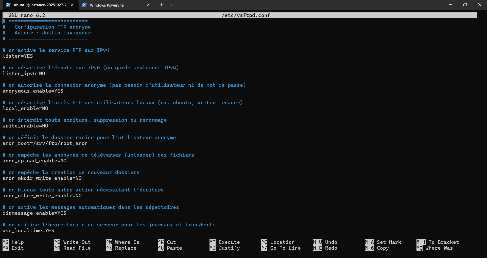
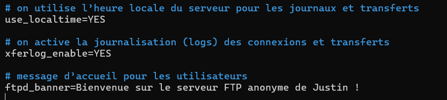
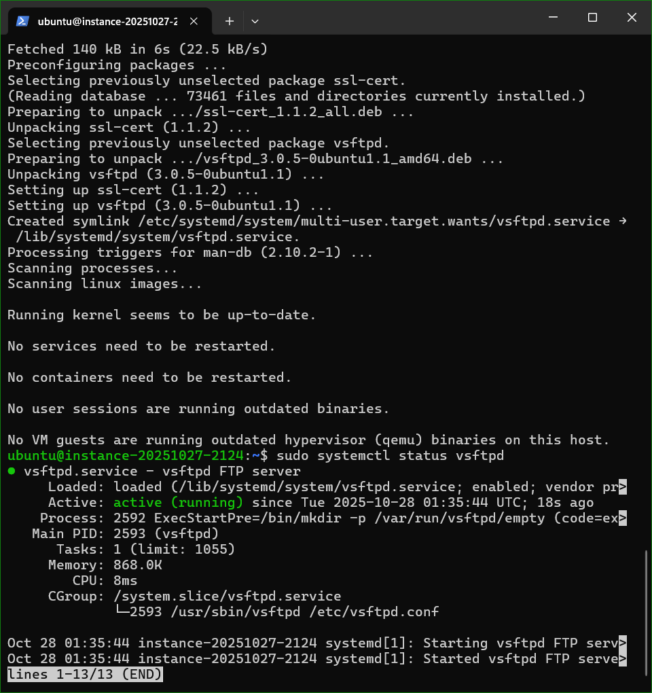
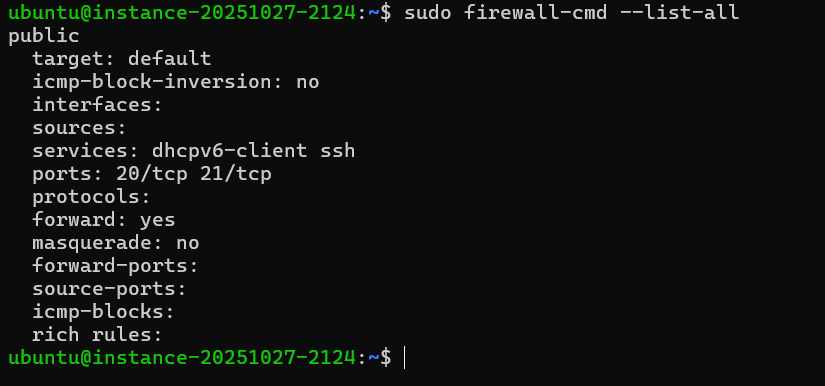
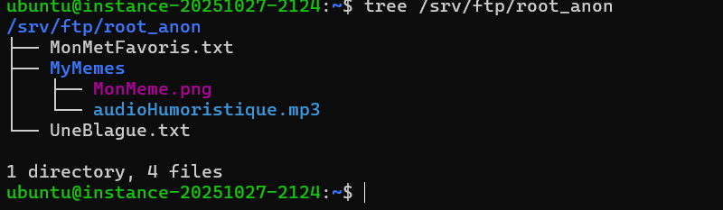
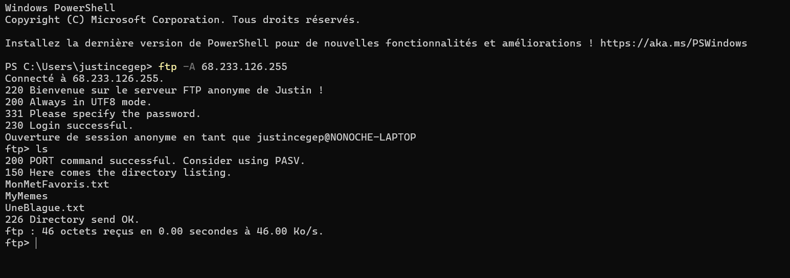
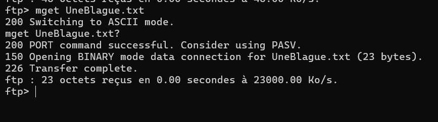
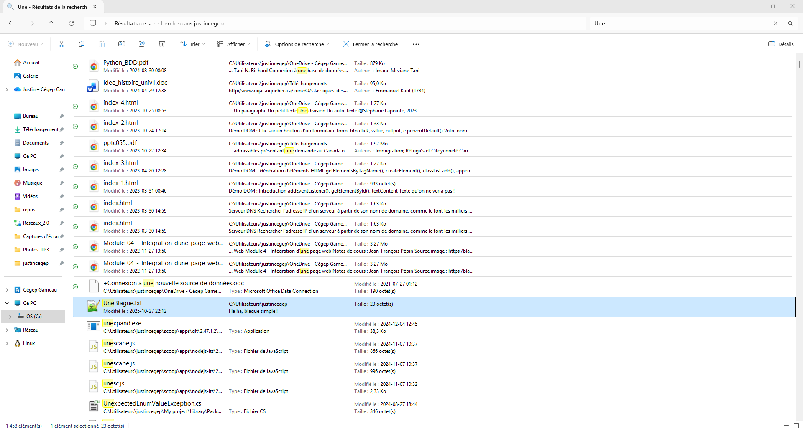

# TP3 – Réseau
**Cours : Réseau**  
**Travail pratique 3 : Installation et configuration de vsftpd**

---

# === FTP anonyme ===

## 1. Installation de vsftpd
On met à jour le système et on installe vsftpd : 
- `sudo apt update`
- `sudo apt install vsftpd -y`
- `sudo systemctl status vsftpd`

On crée un dossier pour l’FTP anonyme :  
- `sudo mkdir -p /srv/ftp/root_anon`

## 2. Ajout de fichiers dans le FTP anonyme
On crée des fichiers pour tester : 
- `echo "Ha ha, blague simple !" | sudo tee /srv/ftp/root_anon/UneBlague.txt`
- `echo "J’aime les pâtes." | sudo tee /srv/ftp/root_anon/MonMetFavoris.txt`

Pour voir le contenu de ces fichiers fraichement créés:
- `cat /srv/ftp/root_anon/UneBlague.txt`
- `cat /srv/ftp/root_anon/MonMetFavoris.txt`

Image pour cat :

On crée par la suite un sous-dossier pour d’autres fichiers selon les dires du prof :  
- `sudo mkdir -p /srv/ftp/root_anon/MyMemes`
- `sudo touch /srv/ftp/root_anon/MyMemes/MonMeme.png`
- `sudo touch /srv/ftp/root_anon/MyMemes/audioHumoristique.mp3`
  
On applique les permissions de l'anonyme (lecture seulement) :  
- `sudo chmod 555 /srv/ftp/root_anon`

## 3. Configuration de vsftpd
On édite le fichier de configuration pour qu'un utilisateur anonyme utilise FTP :
- `sudo nano /etc/vsftpd.conf`

On met ce contenu suivant dans le fichier de configuration ftp (On va devoir le changer pour les utilisateurs locaux plus tard)

### Configuration FTP Anonyme
**Auteur : Justin**

Ce fichier décrit la configuration du serveur **vsftpd** pour permettre un accès **anonyme en lecture seule**.

#### Tableau de configuration

| Directive | Description |
|------------|--------------|
| `listen=YES` | Active le service FTP sur IPv4. |
| `anonymous_enable=YES` | Autorise la connexion anonyme (sans nom d’utilisateur ni mot de passe). |
| `local_enable=NO` | Désactive l’accès FTP des utilisateurs locaux du système (ex. ubuntu, writer, reader). |
| `write_enable=NO` | Interdit toute action d’écriture, de suppression ou de renommage. |
| `anon_root=/srv/ftp/root_anon` | Définit le dossier racine pour l’utilisateur anonyme. |
| `anon_upload_enable=NO` | Empêche l’anonyme de téléverser (uploader) des fichiers. |
| `anon_mkdir_write_enable=NO` | Empêche la création de nouveaux dossiers. |
| `anon_other_write_enable=NO` | Bloque toute autre action nécessitant l’écriture. |
| `dirmessage_enable=YES` | Active les messages automatiques dans les répertoires. |
| `use_localtime=YES` | Utilise l’heure locale du serveur pour les journaux et transferts. |
| `xferlog_enable=YES` | Active la journalisation (logs) des connexions et transferts FTP. |
| `ftpd_banner=Bienvenue sur le serveur FTP anonyme de Justin !` | Message affiché lors de la connexion FTP. |
| `listen_ipv6=NO` | Désactive l’écoute sur IPv6 (utilise seulement IPv4). |

**Résumé :**  
Cette configuration permet à quiconque de se connecter en FTP en mode anonyme (`ftp -A <adresse_IP>`),  
de **lire uniquement** les fichiers présents dans `/srv/ftp/root_anon`,  
sans pouvoir les modifier, supprimer ni en créer de nouveaux.

Voici plusieurs images de ce à quoi le fichier de configuration devrait ressembler pour ftp anonyme:

On redémarre et active le service vsftpd :  
- `sudo systemctl restart vsftpd`
- `sudo systemctl enable vsftpd`

On regarde le status de vsftpd pour voir s'il est actif:

S'il est écrit inactif, on peut vérifier le problème avec cette commande-ci (Elle permet de regarder les logs de vsftpd):
- `sudo journalctl -u vsftpd --no-pager -n 30`

## 4. Configuration du firewall
On installe firewalld et on le démarre :  
- `sudo apt-get install firewalld`
- `sudo systemctl enable firewalld`
- `sudo systemctl start firewalld`

On ouvre les ports FTP et recharge le firewall :
- `sudo firewall-cmd --zone=public --add-port=20/tcp --permanent`
- `sudo firewall-cmd --zone=public --add-port=21/tcp --permanent`
- `sudo firewall-cmd --reload`
- `sudo firewall-cmd --list-all`

Dans cette image, on voit que le port 20 et 21 (pour ftp) sont acceptés sur le firewall:

## 5. Vérification de la structure du dossier FTP
 Dans mon cas, j'ai installé tree pour visualiser l'arborescence du dossier root_anon:
 - `sudo apt install tree`

On vérifie la structure avec la commande suivante: 
- `tree /srv/ftp/root_anon`

Voici une photo de ce que devrait donner:

## 6. FTP anonyme installé correctement
Résultat attendu pour la connexion anonyme :

On peut par la suite regarder si nos fichiers créés un peu plus haut sont présents et mettre un des fichiers sur notre ordinateur personnel avec mget:

On vérifie s'il est bien sur notre ordinateur personnel: 

---

# === Utilisateurs locaux ===

## 1. Création des utilisateurs locaux dans la VM
On crée respectivement les utilisateurs locaux qu'on a de besoin pour le TP3 :
- `sudo adduser ftpadmin # mot de passe : ftpadmin` 
- `sudo adduser writer # mot de passe : writer`
- `sudo adduser reader # mot de passe : reader`

**Pour information**, j'ai décidé de créer l'utilisateur du nom `ftpadmin` à la place de `admin` comme demandé dans le TP3.  
La raison est simple : quand j'écrivais `admin` dans le fichier `vsftpd.userlist`, **il me mettait en mode admin sur ma VM** et quand je quittais, **la clé SSL ne marchait plus**, donc j'ai dû **recommencer 2-3 instances** juste à cause de ça.

## 2. Création de leurs dossiers
On va faire correspondre les chemins indiqués selon l'énoncé :
- `sudo mkdir -p /home/ubuntu/writer`
- `sudo mkdir -p /home/ubuntu/reader`

## 3. Sous dossiers **files** (contenu présent dans les dossiers utilisateurs) 
- `sudo mkdir -p /home/ubuntu/writer/files`
- `sudo mkdir -p /home/ubuntu/reader/files`

On ne fait rien pour le dossier de ftpadmin, puisqu'il existe de base /home/ubuntu dans ftp

Pour lecture seule : 
- `sudo chmod 555 /home/ubuntu/reader/files`

## 4. Attribution des propriétaires
Le dossier parent appartient à root (sécurise le chroot) :
- `sudo chown root:root /home/ubuntu`
- `sudo chown ftpadmin:ftpadmin /home/ubuntu/writer`
- `sudo chown ftpadmin:ftpadmin /home/ubuntu/reader`

## 5. Le sous-dossier “files” appartient à l'utilisateur
- `sudo chown writer:writer /home/ubuntu/writer/files`
- `sudo chown reader:reader /home/ubuntu/reader/files`

## 6. Changement des répertoires home des utilisateurs
- `sudo usermod -d /home/ubuntu/reader reader`
- `sudo usermod -d /home/ubuntu/writer writer`
- `sudo usermod -d /home/ubuntu ftpadmin`

  Voici une photo qui montre les répertoires home des utilisateurs:
  

## 7. Permissions sécurisées
- `sudo chmod 755 /home/ubuntu/reader`
- `sudo chmod 755 /home/ubuntu/writer`
- `sudo chmod 755 /home/ubuntu`
- `sudo chmod 755 /home/ubuntu/reader/files`
- `sudo chmod 755 /home/ubuntu/writer/files`

## 8. Fichiers de liste vsftpd
- `sudo nano /etc/vsftpd.userlist`

On met le contenu suivant dans vsftpd.userlist : 
| Utilisateur | Description |
|-------------|------------|
| ftpadmin    | Utilisateur FTP administrateur autorisé à se connecter |
| writer      | Utilisateur FTP pouvant lire et écrire dans son dossier |
| reader      | Utilisateur FTP en lecture seule dans son dossier |

Voici une photo pour le montrer:

On peut simplement ecrire **ftpadmin** dans vsftpd.chroot_list puisque cèst le seul utilisateur qui n'est pas chroot dans un dossier propre (son home)
- `sudo nano /etc/vsftpd.chroot_list`

## 9. Changement de configuration de FTP (vsftpd.conf)

| Directive | Valeur | Description |
|-----------|--------|------------|
| ftpd_banner | Bienvenue sur le serveur FTP de Justin ! | Message d’accueil affiché lors de la connexion FTP |
| listen | YES | Active le service FTP sur IPv4 |
| listen_ipv6 | NO | Désactive l’écoute IPv6 |
| anonymous_enable | NO | Empêche la connexion anonyme |
| local_enable | YES | Autorise les utilisateurs locaux à se connecter |
| write_enable | YES | Permet l’écriture pour les utilisateurs locaux (upload, suppression, renommage) |
| chroot_local_user | YES | Active le chroot pour tous les utilisateurs locaux |
| allow_writeable_chroot | YES | Permet aux utilisateurs d’écrire dans leur home même si chroot est activé |
| chroot_list_enable | YES | Active le fichier d’exceptions pour le chroot |
| chroot_list_file | /etc/vsftpd.chroot_list | Fichier listant les utilisateurs non chrootés |
| userlist_enable | YES | Active la gestion d’une liste d’utilisateurs autorisés |
| userlist_file | /etc/vsftpd.userlist | Fichier listant les utilisateurs autorisés à se connecter |
| userlist_deny | NO | Seuls les utilisateurs présents dans `userlist_file` peuvent se connecter |
| secure_chroot_dir | /var/run/vsftpd/empty | Répertoire sécurisé nécessaire à vsftpd pour le chroot |

## 10. Photos qui montrent certaines étapes:

Résultat attendu pour le chroot de l'utilisateur reader  :

---

# === Utilisateurs virtuels ===

## 1. Installation de db-util si nécessaire
- `sudo apt update`
- `sudo apt install db-util -y`

## 2. Création des dossiers pour les utilisateurs virtuels
- `sudo mkdir -p /home/ubuntu/iamgroot/files`
- `sudo mkdir -p /home/ubuntu/vwrite/files`
- `sudo mkdir -p /home/ubuntu/vreader/files`

## 3. Création ou vérification que l’utilisateur 'ftp' existe (utilisé comme compte invité)
- `sudo adduser --home /home/ftp --shell /bin/false ftp`

## 4. On donne la propriété des dossiers à 'ftp'
- `sudo chown -R ftp:ftp /home/ubuntu/iamgroot
- `sudo chown -R ftp:ftp /home/ubuntu/vwrite`
- `sudo chown -R ftp:ftp /home/ubuntu/vreader`

## 5. On définit les permissions selon le rôle de chaque utilisateur (énoncé du TP3)
- `sudo chmod -R 777 /home/ubuntu/iamgroot   # lecture/écriture/suppression complète`
- `sudo chmod -R 775 /home/ubuntu/vwrite     # lecture + écriture`
- `sudo chmod -R 755 /home/ubuntu/vreader    # lecture seule`

## 6. Création du fichier de login (nom/mot de passe). IL est déjà créé de base avec le nom de mes utilisateurs locaux 
- `sudo nano /home/ubuntu/login.txt`

iamgroot
iamgroot
vwrite
vwrite
vreader
vreader

## 7. Génération de la base de données pour PAM à partir de login.txt
- `sudo db_load -T -t hash -f /home/ubuntu/login.txt /home/ubuntu/login.db`
- `sudo chmod 600 /home/ubuntu/login.*`
- `sudo chown root:root /home/ubuntu/login.db`

## 8. Création le fichier PAM pour les utilisateurs virtuels
- `echo "auth required pam_userdb.so db=/home/ubuntu/login" | sudo tee /etc/pam.d/vsftpd.virtual`
- `echo "account required pam_userdb.so db=/home/ubuntu/login" | sudo tee -a /etc/pam.d/vsftpd.virtual`

## 9. Modification du fichier de configuration vsftpd
- `sudo nano /etc/vsftpd.conf`

On ajoute (ou vérifie) les lignes suivantes :

guest_enable=YES
guest_username=ftp
pam_service_name=vsftpd.virtual
user_sub_token=$USER
local_root=/home/ubuntu/$USER

(Et on doit bien garder local_enable=YES, write_enable=YES, chroot_local_user=YES, etc. pour tes utilisateurs locaux.)

## 10. Redémarrage de vsftpd
- `sudo systemctl restart vsftpd`
- `sudo systemctl status vsftpd`

---

# === SSL ===

## 1. Création du certificat
Il vous faut installer le paquet openssl:
- `sudo openssl req -new -x509 -days 365 -nodes -out /etc/ssl/private/vsftpd.cert.pem -keyout /etc/ssl/private/vsftpd.key.pem`

Openssl va vous poser quelques questions, la plus critique est celle ci :
- `Common Name (eg, YOUR name) []:`

Un certificat (vsftpd.cert.pem) ainsi qu'une clé privée (vsftpd.key.pem) ont été générés dans le dossier /etc/ssl/private/. IL faut les sécuriser:
- `sudo chown root:root /etc/ssl/private/vsftpd.cert.*`
- `sudo chmod 600 /etc/ssl/private/vsftpd.cert.*`

## 2. On modifie vsftpd.conf pour SSL
| Directive               | Valeur                         | Description                                                                 |
|-------------------------|--------------------------------|-----------------------------------------------------------------------------|
| ssl_enable              | YES                            | Active le support SSL/TLS pour vsftpd                                        |
| allow_anon_ssl          | NO                             | Interdit aux utilisateurs anonymes d’utiliser SSL                            |
| force_local_data_ssl    | YES                            | Force le chiffrement SSL/TLS pour les transferts de données                  |
| force_local_logins_ssl  | YES                            | Force le chiffrement SSL/TLS pour les connexions des utilisateurs locaux     |
| ssl_tlsv1               | YES                            | Autorise le protocole TLSv1                                                 |
| ssl_sslv2               | NO                             | Désactive le protocole SSLv2                                               |
| ssl_sslv3               | NO                             | Désactive le protocole SSLv3                                               |
| rsa_cert_file           | /etc/ssl/certs/vsftpd.crt     | Chemin vers le certificat SSL du serveur                                    |
| rsa_private_key_file    | /etc/ssl/private/vsftpd.key   | Chemin vers la clé privée correspondante                                     |
| require_ssl_reuse       | NO                             | Empêche la réutilisation des sessions SSL (utile pour certains clients)      |
| ssl_ciphers             | HIGH                           | Définit le niveau de chiffrement pour SSL/TLS (ici : fort)                  |

## 3. Redémarrage de vsftpd
- `sudo systemctl restart vsftpd` 

## 4. Test avec Filezilla
